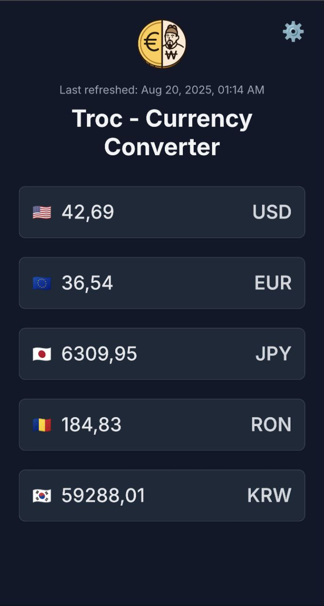

  
  

# Troc - Currency Converter

An open-source Progressive Web App (PWA) for currency conversion.

## Features
- **Daily Rate Updates**: Convert between multiple currencies with exchange rates refreshed once per day.
- **Customizable Currency Selection**: Choose which currencies to display via a settings menu with flag icons.
- **Offline Support**: Use cached rates offline thanks to PWA technology.
- **Theme Support**: Automatically switches between light and dark modes based on device preference.
- **Responsive Design**: Optimized for desktop, tablet, and mobile devices.
- **Installable**: Add to your home screen as a PWA.

## Data Source
Exchange rates are sourced from the [Frankfurter API](https://www.frankfurter.app/docs/), a free, open-source service that leverages data from the European Central Bank (ECB). Rates are updated daily (typically at midnight UTC) and cached in Troc for 24 hours, supporting conversions between approximately 32 currencies (e.g., USD, EUR, KRW). The API is reliable for general use but limited to daily updates, not real-time, and may be subject to occasional downtime or rate limits for free users.

## Screenshots

